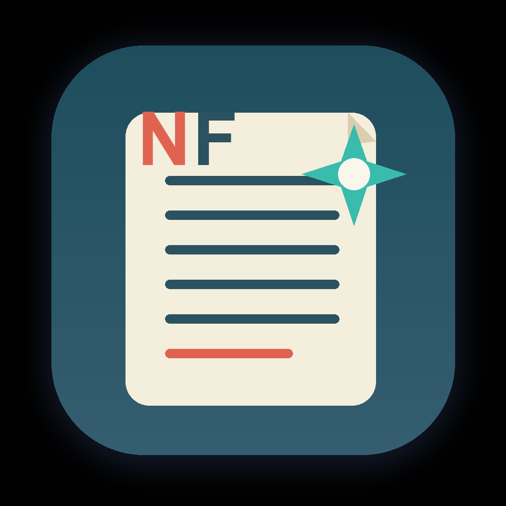

# NovelForge AI



[](https://github.com/xdgf558/novelforge-ai/actions/workflows/ci.yml)

NovelForge AI 是一个本地优先、作者主导的 AI 小说创作工作台，面向长篇连载、独立短故事和系列短故事。它不只是生成正文，还把设定版本、角色状态、章节摘要、时间线、伏笔、连续性检查和 AI 任务记录组织成可审阅的结构化记忆。

NovelForge AI is a local-first, author-controlled AI writing workbench for serialized novels, short stories, and linked story series.

## 核心能力

- 长篇连载：大纲、故事线、章节节拍、草稿、精修、摘要、待审核记忆更新和连续性检查。
- 短故事：故事蓝图、内部写作单元、整篇审校、完整成稿导出和独立叙事闭环。
- 系列短故事：共享世界观、跨篇规则、长期谜团、复现角色与篇目推进记录。
- 作者审批：AI 输出默认只进入草案或待审核区，不会静默改写正式设定和故事记忆。
- 本地数据：SQLite 数据库和生成资产保存在本机，支持本地备份。
- 多模型接入：通过 OpenAI-compatible API 配置通用模型，也可为章节草稿和正文精修配置独立 Kimi 路由。
- 桌面应用：提供 macOS Electron 打包流程；安装包不提交到 Git 仓库。

## 当前状态

当前版本为 `0.1.113`，仍处于本地单用户 MVP 阶段。团队协作、SaaS 多租户、云同步、支付、移动端和自动发布不在当前范围内。详细边界与设计决策见 [项目记忆](docs/project-memory.md) 和 [产品记忆设计](docs/product-memory-design.md)。

## 本地开发

建议使用 Node.js 22 LTS 和 npm。

```bash
git clone https://github.com/xdgf558/novelforge-ai.git
cd novelforge-ai
npm ci
cp .env.example .env
npm run prisma:migrate
npm run dev
```

默认地址为 `http://localhost:3000`。

AI 调用只从本地服务端发起。可在应用的“本机接入设置”中配置 API Key、模型和 Base URL，也可以编辑 `.env`。本地优先不等于完全离线：执行 AI、语音或发布任务时，相关上下文会发送到作者主动配置的服务商。

## 数据位置

开发模式默认使用 `DATABASE_URL` 指向的 SQLite 文件。macOS 桌面版运行数据位于：

- 数据库：`~/Library/Application Support/NovelForge AI/data/novelforge-ai.sqlite`
- 本机配置：`~/Library/Application Support/NovelForge AI/.env`
- 备份：`~/Library/Application Support/NovelForge AI/backups`

数据库、API Key、作者作品、生成资产和安装包都不应提交到仓库。

## 质量检查

```bash
npm test
npm run typecheck
npm run build
npm run desktop:smoke
npm run mvp:acceptance
npm run work-types:acceptance
npm audit --omit=dev --audit-level=high
```

## macOS 桌面打包

```bash
npm run desktop:dev
npm run desktop:pack:mac
npm run desktop:dist:mac
```

签名、公证和发布细节见 [macOS 打包说明](docs/macos-desktop-packaging.md)。公开仓库不提供未经明确发布流程验证的安装包；本地构建产物统一写入被忽略的 `release/` 目录。

## 参与项目

提交改动前请阅读 [贡献指南](CONTRIBUTING.md)、[行为准则](CODE_OF_CONDUCT.md) 和 [安全政策](SECURITY.md)。产品最重要的不变量是作者控制权：AI 可以建议变化，但正式设定、角色、世界规则、时间线和伏笔只能在作者确认后更新。

## 许可证

本仓库公开可见，但目前不是开源软件。除 GitHub 平台正常浏览和派生仓库所必需的权利外，未授予复制、修改、分发、商业使用或部署服务的许可。详见 [LICENSE](LICENSE)。
